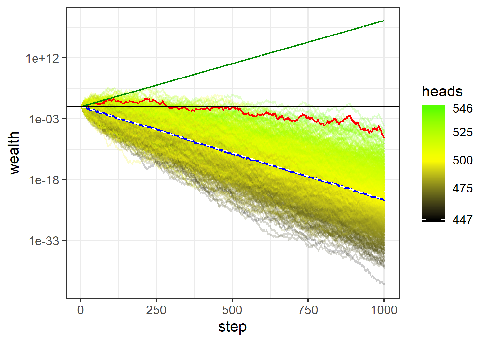
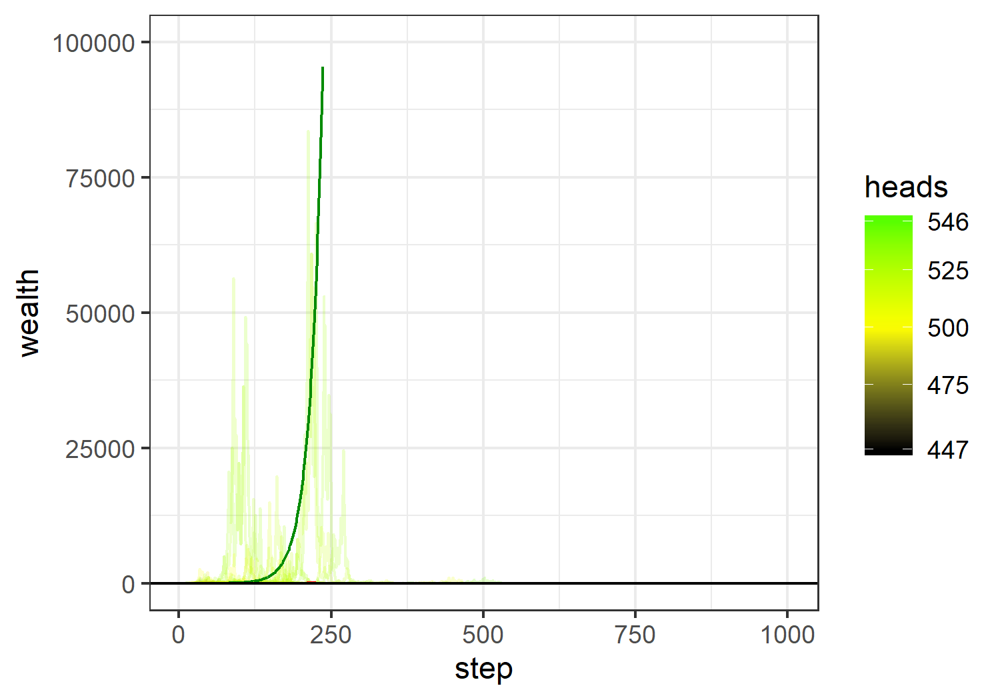

## Ergodicity

Ergodicity is one of those weird things that is hard to grasp by reading the definition. Yet most people do have some gut feeling of it.

Consider a random process, let's say a coin flip. It gives either head or tail with probability 0.5 each. Imagine someone will pay you a dollar if it's head and you'll pay 98 cents if it's tail. Should you take that gamble? 

It seems obvious but let's calculate expected payoff: $$E(x) = \sum p_i x_i = 0.5 \times 1 + 0.5 \times (-0.98) = 0.01$$
So each coin toss gives you on average 1 cent. Sure, you should take that bet. And after 1000 tosses you may expect to pocket $10.
Now if 1000 people took the same bet once, they'd have the same expected value of 0.01 (~500 of them with a dollar and ~500 of them with -98 cents). And if each one of them continued betting by the 1000th coin toss all would expect to have extra $10. Sure, some would get slightly more, some slightly less but the expected value for each would be the same, wether you average by time or by gamblers at any particular round of coin toss. This process is ergodic.

A different bet is described by e.g. [Ole Peters](http://tuvalu.santafe.edu/~ole/): head - you gain 50% of your current wealth (wealth $\times$ 1.5), tail - you lose 40% (wealth $\times$ 0.6).
Expected value for such a process is 

\begin{align}
E(x) = \sum p_i x_i = 0.5 \times 1.5 + 0.5 \times 0.6 = 1.05

\end{align}

which looks favorable, on average your wealth is going to grow. Yet it won't. Since it's a multiplicative process, better way to calculate what to expect after each coin toss is to find geometric mean: [^1]

[^1]: Note that for previous gamble this logic does not appy because we don't know what fraction of total wealth \$1 is.

$$G_1(x) = \prod x_i^{p_i} = 1.5^{0.5}\times 0.6^{0.5} \approx 0.95$$


If you continue taking this bet, after 1000 coin tosses, you may expect to have $G_{1000}(x) = 0.95^{1000} = 1.3 \cdot 10^{-23}$. Eventually -- if it's still unclear -- you'll be broke.
$$\lim_{t \to \infty} G_t(x) = 0$$
where *t* is number of tosses.

Again, let's expand this gamble to 1000 people betting \$1. About half of them will get heads and win 50% while the other half will get tails and lose 40%. Average wealth will be $$0.5\times 1.5 + 0.5\times 0.6 = 1.05$$

After two tosses, there will be 25% HH, 50% HT, and 25% TT outcomes with corresponding cumulative assets of 2.25, 0.9, and 0.36, respectively. Average wealth will be $$0.25\times 2.25 + 0.5\times 0.9 + 0.25\times 0.36 = 1.1025 = 1.05^2$$

So after *t* tosses, average wealth of large number of betters should follow geometric series and have no upper boundary. $$E_n(x) = 1.05^n$$ $$\lim_{t \to \infty} E_n(x) = \infty$$

We end up in a situation, where each individual gambler can be certain to get broke at some point yet cumulative (and possibly average) wealth grows infinitely. This is non-ergodic process. Essentially it means a process where time-averaged expected value is different from ensemble-averaged.

One way to confirm that would be to run a simulation.

```{r setup, echo=FALSE, warning=FALSE, error=FALSE, message=FALSE}
require(tidyverse)
require(gridExtra)
```

## Simulation {.tabset}

### Result
Plot below shows 1000 simulations (trajectories) of 1000 coin tosses with payoffs described above. Dark green line is the theoretical expected value $E_t(x)$, red line is actual mean wealth among 1000 trajectories blue line shows median wealth and white dashed line on top of it is theoretical geometric average $G_t(x)$. Horizontal black line denotes wealth = 1. Each trajectory is colored according to the final number of heads it has by the 1000th coin toss. Note the logarithmic scale for wealth.



Dark green and dashed white lines are clearly diverging, which signifies non-ergodic process. But the red line (actual mean) seems to travel entirely new own path. What's going on here?

If you look at the same plot in linear scale, however, you might think that expected value $E_t(x)$ converges to 0 pretty quickly (only tiny red bumps are visible above 0). Both time- and ensemble-averaged expected values turn out to be 0, so the process even appears to be ergodic.



### Code
Code for simulations and plots.

```{r sim-code, eval = FALSE, warning=FALSE, error=FALSE, message=FALSE}
pay <- c(.5, -.4)  # payoff if win or loss
ppay <- c(.5, .5)   # probability of win and loss 
steps <- 100      # number of steps in each simulation run
threturn <- sum((pay + 1) * ppay)
geomreturn <- prod((pay + 1)^ppay)

trajectory <- function(steps){
  # Creates simulation of random returns and returns 
  # the data series
  wealth <- 1
  
  for (i in c(1:steps)){
    # randomly draw a value from (1,2) and
    # assign corresponding payoff to return
    # then add 1 to convert to multiplier for wealth
    ret <- 1 + sample(c(1,2), 1, prob = ppay) %>% pay[.] 
    
    # record new wealth value
    wealth[i+1] <- wealth[i] * ret
  }
  
  return(wealth)
}


ensemble <- function(N, steps){
  # Creates ensemble of simulation trajectories
  # uses trajectory() function
  ens <- data.frame(wealth=NULL, 
                    step=NULL, 
                    id=NULL)
  for (i in seq(1:N)){
    wealth <- trajectory(steps)
    step <- seq(1:(steps + 1))
    id <- rep(i, steps + 1)
    ens <- rbind(ens, data.frame(wealth, step, id))
    if (i %% (N %/% 10) == 0) print(rep('*', i %/% (N %/% 10))) # progress bar
  }
  return(ens)
}

df <- ensemble(1000, 1000)

df_summary <- df %>% 
  group_by(step) %>%
  summarise(mean = mean(wealth), median = median(wealth))

head_count <- function(w){
  # subracts vector lagged by 1 from the initial vector 
  # and counts positive instances (heads)
  sum(w[2:length(w)] - w[1:(length(w) - 1)] > 0)
}


# add head count information to trajectories
df <- df %>%
  group_by(id) %>%
  summarise(heads = head_count(wealth)) %>%
  merge(df)


# theoretical E(x) curve
wealth = 1
for (i in seq(1:(nrow(df_summary) - 1))){
  wealth = c(wealth, wealth[i] * threturn)
}
th_trajectory <- data.frame(step = df_summary$step, 
                            wealth = wealth) 

wealth = 1
for (i in seq(1:(nrow(df_summary) - 1))){
  wealth = c(wealth, wealth[i] * geomreturn)
}

geom_trajectory <- data.frame(step = df_summary$step,
                              wealth = wealth)

ggplot(df, aes(x = step, y = wealth, group=id))+
  geom_line(aes(color = heads), alpha = .2)+
  geom_line(data = df_summary, aes(y = mean, group = NULL), color = 'red')+
  geom_line(data = df_summary, aes(y = median, group = NULL), color = 'blue')+
  geom_line(data = th_trajectory, aes(y = wealth, group = NULL), color = 'green4')+
  geom_line(data = geom_trajectory, aes(y = wealth, group = NULL), color = 'white', linetype = 'dashed')+
  geom_abline(slope = 0, intercept = 0)+
  scale_y_log10()+
  scale_color_gradient2(low = 'black', mid = 'yellow', high = 'green', 
                        midpoint = 500, breaks = c(min(df$heads), 475, 500, 525, 550, max(df$heads)))+
  theme_bw()

ggsave('tmp/simplot.png', width = 5, height = 3.5)

ggplot(df, aes(x = step, y = wealth, group=id))+
  geom_line(aes(color = heads), alpha = .2)+
  geom_line(data = df_summary, aes(y = mean, group = NULL), color = 'red')+
  geom_line(data = df_summary, aes(y = median, group = NULL), color = 'blue')+
  geom_line(data = th_trajectory, aes(y = wealth, group = NULL), color = 'green4')+
  geom_line(data = geom_trajectory, aes(y = wealth, group = NULL), color = 'white', linetype = 'dashed')+
  geom_abline(slope = 0, intercept = 0)+
  scale_color_gradient2(low = 'black', mid = 'yellow', high = 'green', 
                        midpoint = 500, breaks = c(min(df$heads), 475, 500, 525, 550, max(df$heads)))+
  theme_bw()+
  ylim(0,1e5)

ggsave("tmp/simplot-linear.png", width = 5, height = 3.5)
```

## Where's mistake? {.tabset}
### Discussion
The reason for this apparent paradox is that the number of possible trajectories grows exponentially as $2^t$. The ensemble of 1000 trajectories becomes not representative of this new universe. By $t = 300$ it covers only $\frac{1000}{2^{300}} = 5.5\times10^{-88}$ fraction of possible outcomes. To understand the scale, the volume of observable Universe $\approx 3.6 \times 10^{89}$ *microliters*.[^2]

[^2]: Sure, if you randomly sample 1000 microliters from the Universe you can correctly conclude that it's mostly empty but you'd totally miss the big picture. 

Second important factor is that those mind-boggingly-low-probability trajectories have mind-boggingly-to-the power-of-three-huge returns that dominate calculation of expected value. So that actual mean is truly described by the dark green line in the first figure.

It is actually not that hard to calculate the expected return explicitly. Since the coin toss is the binomial process, all the formulas for calculations are easy to derive.

$$P_t(h) = \binom{t}{h} p^h \left(1-p \right)^{t-h} \overset{(p=1-p)}= \binom{t}{h} p^t$$
where $P_t(h)$ is probability of *h* heads out of *t* tosses.
$$W_t(h) = w_H^h w_T^{t-h}$$
where $W_t(h)$ is wealth after *h* heads out of *t* tosses, $w_H$ and $w_T$ are payoffs in cases of head and tail, respectively.

Expected value for the payoff then will be
$$E(W_t) = \sum_{h = 0}^t P_t(h) W_t(h) = \sum_{h = 0}^t \binom{t}{h} p^t w_H^h w_T^{t-h}$$

For t = 1000, $E(W_t) =  1.546319\times 10^{21} = (1.05)^{1000}$ q.e.d.

In a simulation, in order to achieve $E(W_{1000}) \geqslant 1.546319\times 10^{21}$, one would need a single lucky trajectory with $W_{1000}(h) \geqslant 1000\times E(W_{1000}) = 1.546319\times 10^{24}$ (other trajectories' contributions are negligible). For this required number of heads $h \geqslant 619$, with corresponding probability of $4\times 10^{-14}$. In other words, never on my laptop. 

### Code
```{r solution, warning=FALSE, error=FALSE, message=FALSE}
pheads <- function(p = 0.5, h, t) choose(t, h)*p^t
ret <- function(h,t) 1.5^h*0.6^(t-h)

# All numbers of heads possible
h <- c(0:1000)
# corresponding probabilities
dh <- pheads(h = h, t = 1000)
# payoff for each number of heads
rh <- ret(h = h, t = 1000)
# total return over T tosses
total_return <- dh * rh

# Check if the total return is the same as arithmetical (1.05^T)
sum(total_return) / 1.05^1000 # yes it is!
```

## Some implications

Now I think it's clear that simulation has to be approached with care for some aspects of a non-ergodic process. Let's look at some implications of the process at hand. First, for any *finite* number of trajectories average wealth will go to 0 at sufficient number of tosses: $\lim_{t \to\infty} NG_t(x) = N \lim_{t\to\infty}G_t(x) = 0$.

But then what's the probability of still getting positive return after 1000 tosses?

```{r probability_positive, warning=FALSE, error=FALSE, message=FALSE}
# what is the probability to have positive return?
positive_return_idx <- which(rh > 1)
# summing up the probabilities for these outcomes
prob_positive_return <- dh[positive_return_idx] %>% sum() %>% print()
```

What's the probability of being ruined? Assuming arbitrary ruin threshold 0.001 of initial wealth.

```{r probability_ruin, warning=FALSE, error=FALSE, message=FALSE}
# if we define ruin as anything less then 0.001
ruin_idx <- which(rh < 0.001)
# then probability of ruin is:
prob_ruin <- dh[ruin_idx] %>% sum() %>% print()
```

How does probability of having positive return changes with number of tosses *t*?

```{r prob-t, warning=FALSE, error=FALSE, message=FALSE}
# Now how does that depends on T?

p.win <- function(t){
  h <- c(0:t)
  dh <- pheads(h = h, t = t)
  rh <- ret(h = h, t = t)
  positive_return_idx <- which(rh > 1)
  prob_positive_return <- dh[positive_return_idx] %>% sum()
  return(prob_positive_return)
}

t <- c(1:1000)
y <- c()
for (i in t){
  y <- c(y, p.win(i))
}

pwin_vs_t <- data.frame(t, y)

ggplot(pwin_vs_t,aes(x = t, y = y))+
  geom_line()+
  scale_y_log10()+
  ylab('P(wealth > 1)')+
  xlab('T')+
  theme_bw()
```

Finally, here's the plot of probability distribution for the different number of heads.

```{r distribution, warning=FALSE, error=FALSE, message=FALSE}
# distribution of probabilities (beta?)
df <- data.frame(h, dh)

p <- ggplot(df, aes(x = h, y = dh))+
  geom_line()+
  theme_bw()+
  ylab('density')+
  xlab('heads')

p.log <- p + ggtitle('Log scale')+
  scale_y_log10()
  

p.lin <- p + ggtitle('Linear scale')

grid.arrange(p.log, p.lin, nrow = 1)
```

... corresponding returns ...

```{r distribution_returns, warning=FALSE, error=FALSE, message=FALSE}
# distribution of returns
df <- data.frame(h, rh) %>% 
  merge(df)

p <- ggplot(df %>% na.omit(), aes(x = h, y = rh))+
  geom_line()+
  ylab('Return')+
  theme_bw()+
  xlab('heads')

p.log <- p + ggtitle('Log scale')+
  scale_y_log10()
  
# For some reason ggplot has trouble drawing linear plot
# p.lin <- p + ggtitle('Linear scale')

grid.arrange(p.log, nrow = 1)

```

... and correspoding probability-weighed contributions to the expected value $E_t(x)$ (product of the last two plots).

```{r distribution_contrib, warning=FALSE, error=FALSE, message=FALSE}
df <- data.frame(h, logcon = log(rh*dh)) %>%
  merge(df)
# distribution of probabilities (beta?)
p.log <- ggplot(df, 
       aes(x = h, y = logcon))+
  geom_line()+
  theme_bw()+
  xlab('heads')+
  ylab('log(Contribution)')+ ggtitle('Log scale')

p.lin <- ggplot(df, 
       aes(x = h, y = exp(logcon)))+
  geom_line()+
  theme_bw()+
  xlab('heads')+
  ylab('Contribution')+
  xlim(500, 800)+ ggtitle('Linear scale')

grid.arrange(p.log, p.lin, nrow=1)
```
